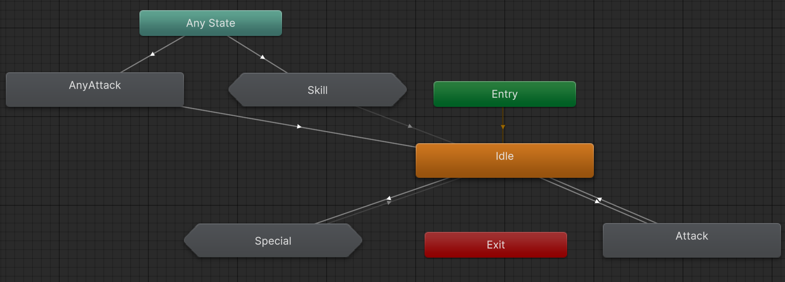

유니티에서 현재 애니메이션 상태에 따라 로직의 실행 가능 여부를 확인하기 위한 기능을 리서치 해 보았다

    <button class="code-toggle">CollapseExpand</button>
    
using System.Collections.Generic;
using UnityEngine;
using UnityEngine.Timeline;

public class AnimatorTestController : MonoBehaviour
{
    [SerializeField] private Animator _animator;

    [SerializeField] private List<string> _clipNames;
    [SerializeField] private List<string> _nextClipNames;
    [SerializeField] private string _stateInfo = "";
    [SerializeField] private string _nextStateInfo = "";
    [SerializeField] private bool _isSkillState = false;
    [SerializeField] private bool _isSpecialState = false;
    [SerializeField] private bool _isAttackState = false;
    [SerializeField] private bool _isSubStateMachine = false;
    [SerializeField] private bool _isInTransition = false;
    [SerializeField] private string _transitionInfo = "";
    private void Update()
    {
        //애니메이션 테스트용 버튼들
        _animator.SetBool("Attack", Input.GetKeyDown(KeyCode.Alpha1));
        _animator.SetBool("Skill", Input.GetKeyDown(KeyCode.Alpha2));
        _animator.SetBool("Special", Input.GetKeyDown(KeyCode.Alpha3));
        _animator.SetBool("AnyAttack", Input.GetKeyDown(KeyCode.Alpha4));

        // 현재 실행중인 클립들을 가져온다.// 트렌지션 중이어도 현재 클립의 이름을 가져옴
        // next는 트랜지션 중일때 다음 실행될 클립을 가져온다.// 배열 형태로 가져온다
        AnimatorClipInfo[] clipInfos = _animator.GetCurrentAnimatorClipInfo(0);
        AnimatorClipInfo[] nextClipInfos = _animator.GetNextAnimatorClipInfo(0);
        _clipNames.Clear();
        _nextClipNames.Clear();
        foreach (var clipInfo in clipInfos)
        {
            _clipNames.Add(clipInfo.clip.name);
        }
        foreach (var clipInfo in nextClipInfos)
        {
            _nextClipNames.Add(clipInfo.clip.name);
        }

        // 현재 실행중인 스테이트를 가져온다 이역시 next와 current 는 클립과 같은 방법으로 동작한다
        AnimatorStateInfo stateInfo = _animator.GetCurrentAnimatorStateInfo(0);
        AnimatorStateInfo nextStateInfo = _animator.GetNextAnimatorStateInfo(0);
        _stateInfo = stateInfo.fullPathHash.ToString();
        _nextStateInfo = nextStateInfo.fullPathHash.ToString();
        _isAttackState = stateInfo.IsName("Attack");
        _isSkillState = stateInfo.IsName("Skill");
        _isSpecialState = stateInfo.IsName("Special");
        _isSubStateMachine = stateInfo.IsName("Skill.Skill_A"); // SubState는 .으로 구분하여 이름을 구분한다

        // 현재 트랜지션 중인지, 그리고 Any 스테이트에서 발생한 트랜지션인지 확인한다.
        _isInTransition = _animator.IsInTransition(0);
        if (_isInTransition)
        {
            AnimatorTransitionInfo transitionInfo = _animator.GetAnimatorTransitionInfo(0);
            string transitionHash = transitionInfo.fullPathHash.ToString();
            _transitionInfo = transitionInfo.anyState ? $"From Any State{transitionHash}" : transitionHash;
        }
        else
        {
            _transitionInfo = "";
        }
    }
}
    

## 애니메이터의 상태
-애니메이터가 transition 중인지
-anyState에서 발생한 트랜지션인다
-현재 어떤 Clip, State를 실행하고있는지
-트랜지션 중이라면 다음 Clip,State는 무엇인지 스크립트 내에서 알 수 있다.

## 단점
-string형태로 이름을 가져오는 방식이 아니라 해시값을 이용하기 때문에 이름으로 비교하기 쉽지 않다.
-State의 이름을 직접 입력해 해시값을 구해 그것을 비교해야한다

-이것은 다른 단점이지만 애니메이션 이벤트를 사용할때 Transition 시간에 의해 불리지 않거나 예상치 못할 때 불리는 경우가 종종 있다.

 이런 단점을 해결하기 위해 animacer라는 UnityAnimator 대체 에셋을 찾았고 이를 공부해 보기로 했다.