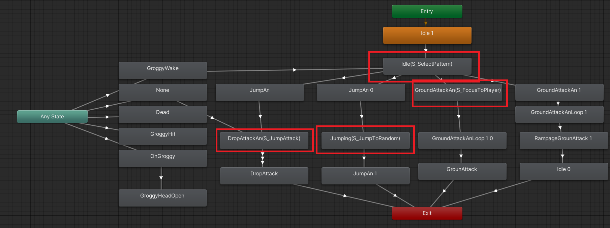

# 애니메이터를 활용한 보스 AI 구현 분석

## 개요
Unity의 Animator를 스테이트 머신으로 활용하여 보스 AI를 구현했습니다

## 구현 구조

### 1. 애니메이터 설계
- Idle, Attack, Groggy 상태 구현
- 각 상태 간 전환 조건 설정
- 파라미터를 통한 상태 제어
- 스테이트 비헤이비어 코드를 사용한 스테이트 진입시 스크립트 실행

### 2. 코드 구현

#### 기본 보스 클래스

    <button class="code-toggle">Expand</button>
    
using System;
using System.Collections;
using System.Collections.Generic;
using TMPro;
using UnityEngine;
using UnityEngine.Assertions;

public class FalseKnightMainBody : Character
{
    public FalseKnight owner;
    public CombatComponent combatComponent;
    public Action OnFalseKnightDead;

    private Animator _animator;
    public GameObject[] damagedEffects;

    private void Awake()
    {
        _animator = GetComponent<Animator>();
        Assert.IsNotNull(_animator);
        Assert.IsNotNull(combatComponent);
        combatComponent.Init(transform);
        combatComponent.OnDamaged += OnDamaged;
        combatComponent.OnDead += OnDead;
    }

    public void ResetMainBody()
    {
        combatComponent.ResetDead();
    }
    public void Spawn()
    {
        ResetMainBody();
        gameObject.SetActive(true);
    }

    private void OnDamaged()
    {
        _animator.SetTrigger("Hit");
    }
    private void OnDead()
    {
        OnFalseKnightDead.Invoke();
        gameObject.SetActive(false);
    }

    public override CombatComponent GetCombatComponent()
    {
        return combatComponent;
    }
}

    

    <button class="code-toggle">Expand</button>
    
    
using System;
using System.Collections;
using Unity.VisualScripting;
using UnityEngine;
using UnityEngine.Assertions;
using UnityEngine.Rendering.Universal;

public enum FalseKnightState
{
    Idle, JumpAttack, Jump, GroundAttack, Rampage, MainBody, Dead
}
public class FalseKnight : Character
{
    public FalseKnightState state;

    //public MoveComponent moveComponent;
    public CombatComponent combatComponent;

    public bool isGrounded;

    private Animator _animator;
    private Transform _target;
    private Rigidbody2D _rigidbody;

    //점프할때 grounded 잠시 무시해줘야 isgrounded가 예상대로 작동함 안그러면 점프 하자마자 착지했다고 판정됨
    //아니면 점프에서 isjumping set 하고 점핑과 alomostOnGroun와 Is Jumping이 둘다 false일때 착지 모션을 들어가게 하자
    private float groundIgnoreTime = 0f;
    private float _invincibleTime;
    private int Phase = 1;
    [SerializeField] Light2D _light;

    //죽었을때 나오는 소울
    [SerializeField] private FalseKnightMainBody _mainBody;
    public GameObject[] damagedEffects;

    public System.Action<FalseKnight> OnStatusChange;
    public System.Action OnFlip;
    public System.Action OnRealDead;

    public bool Fighting = false;
    private Transform[] _jumpTargets;

    private void Awake()
    {
        _animator = transform.GetComponentInChildren<Animator>();
        Assert.IsNotNull(_animator);
        _rigidbody = GetComponent<Rigidbody2D>();
        _target = GameManager.Instance.GetPlayer().transform;
        _mainBody = _mainBody.GetComponent<FalseKnightMainBody>();
        _mainBody.OnFalseKnightDead += OnMainbodyCurrentDead;
        OnRealDead += RealDead;
        combatComponent.OnDead += OnCurrentDead;
        combatComponent.OnDamaged += OnDamaged;
        combatComponent.AdditionalDamageableCondition += IsDamagable;
        combatComponent.Init(transform);
    }

    private bool IsDamagable()
    {
        if (state == FalseKnightState.MainBody)
        {
            return false;
        }
        return true;
    }

    public void ChangeState(FalseKnightState newState)
    {
        state = newState;
        switch (newState)
        {
            case FalseKnightState.Idle:
                _animator.SetTrigger("Idle");
                break;
            case FalseKnightState.JumpAttack:
                _animator.SetTrigger("JumpAttack");
                break;
            case FalseKnightState.Jump:
                _animator.SetTrigger("Jump");
                break;
            case FalseKnightState.GroundAttack:
                _animator.SetTrigger("GroundAttack");
                break;
            case FalseKnightState.Rampage:
                _animator.SetTrigger("Rampage");
                break;
            case FalseKnightState.MainBody:
                _animator.SetTrigger("Stun");
                break;
            case FalseKnightState.Dead:
                _animator.SetTrigger("Dead");
                break;
            default:
                break;
        }
    }

    private void OnEnable()
    {
        isGrounded = false;
        _animator.SetTrigger("Spawn");
    }

    //무적 시간과 grounded 애니메이터 플래그 셋
    private void Update()
    {
        if(state == FalseKnightState.Dead)
        {
            return;
        }
        if (groundIgnoreTime > 0f)
        {
            groundIgnoreTime -= Time.deltaTime;
            _animator.SetBool("AlmostOnGround", false);
        }
        else
        {
            if (isGrounded)
                _animator.SetBool("AlmostOnGround", true);
            else
                _animator.SetBool("AlmostOnGround", false);
        }
        if (_invincibleTime > 0f) { _invincibleTime -= Time.deltaTime; }

    }

    //Ai funcs
    public void JumpToTarget(float time)
    {
        _rigidbody.velocity = Vector3.zero;
        isGrounded = false;
        groundIgnoreTime = .2f;
        float distance = _target.position.x - transform.position.x;
        _rigidbody.AddForce(new Vector2(distance / time, 9.81f * time * .5f), ForceMode2D.Impulse);
        FocusToPlayer();
    }
    public void FocusToPlayer()
    {

        if (_target.position.x - transform.position.x < 0f)
        {
            transform.rotation = Quaternion.Euler(0f, 180f, 0f);
        }
        else
        {
            transform.rotation = Quaternion.Euler(0f, 0f, 0f);
        }
        if(OnFlip != null)
        {
            OnFlip.Invoke();
        }
    }
    public void JumpToFarPoint()
    {
        _animator.SetBool("AlmostOnGround", false);
        groundIgnoreTime += .1f;
        Vector3 targetPos = GetFarJumpTarget();
        float targetVector = -transform.position.x + targetPos.x;
        float time = Mathf.Abs(targetVector * .1f);
        _rigidbody.AddForce(new Vector2(targetVector / time, 9.81f * time * .5f), ForceMode2D.Impulse);
        FocusToPlayer();
    }

    private Vector3 GetFarJumpTarget()
    {
        Transform target = null;
        float maxDist = 0f;
        foreach (Transform t in _jumpTargets)
        {
            float dist = Mathf.Abs(t.position.x - transform.position.x);
            if (dist > maxDist)
            {
                maxDist = dist;
                target = t;
            }            
        }
        return target.position;
    }

    private void OnCurrentDead()
    {
        switch (Phase)
        {
            case 1:
                _animator.SetTrigger("Groggy");
                state = FalseKnightState.MainBody;
                break;
            case 2:
                _animator.SetTrigger("Groggy");
                state = FalseKnightState.MainBody;
                break;
            case 3:
                _animator.SetTrigger("Groggy");
                state = FalseKnightState.MainBody;
                _mainBody.OnFalseKnightDead -= OnMainbodyCurrentDead;
                _mainBody.OnFalseKnightDead += OnRealDead;
                break;
        }
    }

    private void SpawnMainBody()
    {
        _mainBody.Spawn();
    }
    private void OnMainbodyCurrentDead()
    {
        Phase++;
        _invincibleTime = 0f;
        combatComponent.ResetDead();
        _animator.SetTrigger("GroggyDead");
        state = FalseKnightState.Idle;
    }
    //죽으면 트리거 발생시키자 anystat로 빠진 후
    //날라가는 애니메이션 실행 메인바디 스폰 시키고
    //메인바디루프 돌다가 죽으면 다시 idle로 

    //Collisions GroundCheck
    private void EvaluateCollision(Collision2D collision)
    {
        for (int i = 0; i < collision.contactCount; i++)
        {
            Vector2 normal = collision.GetContact(i).normal;
            isGrounded |= normal.y >= .9f;
        }
    }
    private void OnCollisionEnter2D(Collision2D collision)
    {
        EvaluateCollision(collision);
        if (groundIgnoreTime > 0)
            isGrounded = false;
        if (isGrounded)
            _rigidbody.velocity = Vector3.zero;
    }
    private void OnCollisionStay2D(Collision2D collision)
    {
        EvaluateCollision(collision);
        if (groundIgnoreTime > 0)
            isGrounded = false;
    }
    private void OnCollisionExit2D(Collision2D collision)
    {
        isGrounded = false;
    }

    private void DamagedEffect(Vector2 attackerPos, Vector2 damagedPos)
    {
        _light.enabled = true;
        PooledObjectSpawnManager.Instance.SpawnBetweenAttacker(damagedEffects ,attackerPos, damagedPos, 1.5f , 4f);
        StartCoroutine(BlinkOff());

    }

    private IEnumerator BlinkOff()
    {
        yield return new WaitForSeconds(.2f);
        _light.enabled = false;
    }

    public string GetPhase()
    {
        return Phase.ToString();
    }
    public void Flip()
    {
        Quaternion right = Quaternion.Euler(0f, 180f, 0f);
        Quaternion left = Quaternion.Euler(0f, 0f, 0f);
        float curAngle = transform.rotation.eulerAngles.y;

        if (curAngle == 180f)
        {
            transform.rotation = left;
        }
        else
        {
            transform.rotation = right;
        }
        if (OnFlip != null)
        {
            OnFlip.Invoke();
        }
    }
    public void OnGroggy()
    {
        _invincibleTime = 99999999999999f;
        SpawnMainBody();
    }

    public override CombatComponent GetCombatComponent()
    {
        return combatComponent;
    }
    private void OnDamaged()
    {
        //UI
        if (OnStatusChange != null)
        {
            OnStatusChange.Invoke(this);
        }
    }
    public void RealDead()
    {
        _animator.SetTrigger("Dead");
        state = FalseKnightState.Dead;
        PooledObjectSpawnManager.Instance.SpawnMoney(transform.position, 100);
        Destroy(gameObject, 30f);
    }

    public void StartFight()
    {
        _rigidbody.simulated = true;
        _animator.SetTrigger("Start");
    }

    private void OnTriggerEnter2D(Collider2D collision)
    {
        if (Fighting == true)
            return;
        if(collision.CompareTag("Player"))
        {
            Fighting = true;
            _animator.SetBool("Fighting", true);
            _rigidbody.gravityScale = 1f;
        }
    }

    public void SetJumpTarget(Transform[] jumpTargets)
    {
        _jumpTargets = jumpTargets;
    }
}
    

#### 상태별 행동 구현

    <button class="code-toggle">Expand</button>
    using UnityEngine;
//상태 결정 스크립트
public class FalseKnightSelectPattern : StateMachineBehaviour
{
    public float CoolDown = .5f;
    Timer _timer = new Timer();
    public FalseKnightState debugAction = FalseKnightState.Idle;

    public override void OnStateEnter(Animator animator, AnimatorStateInfo stateInfo, int layerIndex)
    {
        _timer.SetTimer(CoolDown);
    }
    public override void OnStateUpdate(Animator animator, AnimatorStateInfo stateInfo, int layerIndex)
    {
        if(_timer.IsTimeOver())
        {
            _timer.ResetTime();
            FalseKnightState start = (FalseKnightState)Random.Range(0, 6);
            if (debugAction != FalseKnightState.Idle)
                start = debugAction;
            switch (start)
            {
                case FalseKnightState.Idle:
                    animator.SetTrigger("Idle");
                    break;
                case FalseKnightState.JumpAttack:
                    animator.SetTrigger("JumpAttack");
                    break;
                case FalseKnightState.Jump:
                    animator.SetTrigger("Jump");
                    break;
                case FalseKnightState.GroundAttack:
                    animator.SetTrigger("GroundAttack");
                    break;
                case FalseKnightState.Rampage:
                    animator.SetTrigger("Rampage");
                    break;
                default:
                    break;
            }
        }
    }
}

    

## 주요 기능

### 1. 상태 관리
- 애니메이터 파라미터를 통한 상태 전환
- Idle 스테이트에서 랜덤한 패턴 선택

### 2. 전투 로직
- 플레이어 추적 및 점프 거리 계산
- 데미지는 애니메이션에서 콜라이더를 끄고 켜 관리

## 장점
애니메이터를 활용한 보스 AI 구현은 스테이트머신 구현 없이 쉽게 구현할 수 있다.

## 단점
- 상태가 많아질수록 관리가 어려워짐
- 스테이트를 클릭해야 코드를 확인 가능 디버깅어 어렵다
- 애니메이션 이벤트와 스테이트 스크립트가 나뉘어 관리가 어렵다

