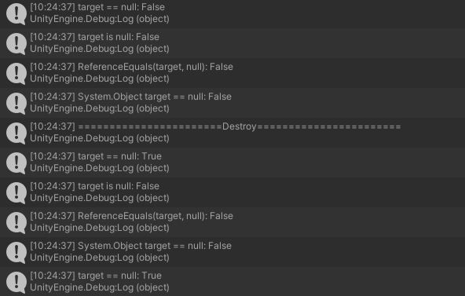

# 유니티의 FakeNull

유니티에서 게임오브젝트와 == null을 비교할때 라이더 IDE에서는 경고를 나타낸다.
이는 내부적으로 == 연산자가 오버라이딩 되어있기 때문에 null체크시 추가적인 연산이 발생하기 때문이다

실제 과정
c++객체에 대한 참조가 생기는 순간 null이 아니게 된다
그 오브젝트를 Destroy시 해당 c#오브젝트 객체는 그대로 존재하고 그 객체는 c++오브젝트를 참조하지 않게 된다
하지만 그 C#오브젝트 자체는 해당 오브젝트에 대한 모든 참조가 사라질때 까지는 남아있는다
이를 위해 직접 GameObject변수에 null을 대입할 수 있지만 모든 참조에 null을 대입하는것이 아니기 때문에 다른곳에서의 참조는 관리하기 어려울 수 있다.

그렇기 때문에 오버라디드 되지 않은 isnull이나 ReferenceEquals를 사용하거나 System.Object의 == 를 사용할 경우 실제 null여부와 다를 수 있다. 

실제로 삭제후 여러 방법으로 체크해보면

이와같이 다른 결과가 나온다.

가비지 컬렉터를 아무리 돌려도 null이 아니다.
C#객체에 대한 참조를 하고 있기 때문

#결론
== null 비교는 생각보다 비싸다
?= ?? 연산자가 예상과 다르게 작동할 수 있다
is null, ReferenceEquals, System.Object의 == 를 사용 시에도 예상과 다른 결과가 나올 수 있다

#아이디어
그렇다면 컴포넌드에 OnDestroy를 통해 삭제되었는지 플래그를 사용하면 성능 개선이 있을까?